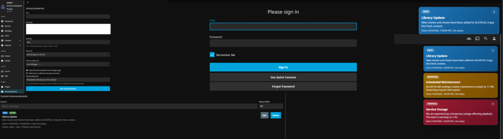

# Jellyfin Announcements Plugin

Server-wide announcements and maintenance banners for Jellyfin.

## Status

- Version: 0.2.0.4
- Target Jellyfin ABI: 10.11.0.0
- Framework: .NET 9

## Features

- Admin CRUD for announcements
- Severity-based messaging: Info, Warning, Critical
- Optional start/end scheduling
- Login-page visibility toggle per announcement
- Optional dismiss controls
- Dismiss behavior: session or permanent
- Auto-load banner script support through index patching

## Screenshot



## Easy Install

Install directly from Jellyfin using a custom repository URL.

Repository URL to add in Jellyfin:

- https://raw.githubusercontent.com/blcksnake/jellyfin-admin-announcements-plugin/main/repository/manifest.json

Steps:

1. Open Jellyfin Dashboard.
2. Go to Plugins.
3. Open Repositories.
4. Add new repository URL using the link above.
5. Go to Catalog and install Announcements.
6. Restart Jellyfin.
7. Hard refresh browser with Ctrl+Shift+R.

No manual file copy and no local build is required for end users.

## Prerequisites

No additional plugin is required.

The Announcements plugin injects its banner script by patching `jellyfin-web/index.html` at startup.
For Linux and container deployments, this requires write permission to the web path.

## Maintainers

For release packaging and repository publishing workflow, see DISTRIBUTION.md.

## Compatibility Notes

- Plugin is tested with Jellyfin 10.11.6.
- Auto web injection now supports Windows, Linux, macOS, and common container layouts.
- Optional overrides for non-standard installs:
	- `JELLYFIN_WEB_INDEX_PATH` (full path to `index.html`)
	- `JELLYFIN_WEB_DIR` (directory containing `index.html`)
- If announcements do not appear:
	1. Confirm index patching can write to the web path.
	2. Restart Jellyfin and hard refresh browser.
	3. Check logs for injection status lines from `[Announcements]`.
	4. Ensure the target index path is writable by the Jellyfin runtime user.

## Troubleshooting: Banner Not Displaying (Linux/Docker)

If logs show permission errors such as `UnauthorizedAccessException` for `/usr/share/jellyfin/web/index.html.bak`, the plugin cannot patch `index.html`.

Check logs:

```bash
docker logs --tail 400 jellyfin 2>&1 | egrep -i "Announcements|inject|index.html|denied|unauthorized|plugin"
```

Quick fix (works immediately):

```bash
docker exec -it jellyfin sh -c '
chmod 777 /usr/share/jellyfin/web
chmod 666 /usr/share/jellyfin/web/index.html
'
docker restart jellyfin
```

Safer fix (recommended over 777/666):

```bash
docker exec -it jellyfin sh -c '
chgrp 1000 /usr/share/jellyfin/web /usr/share/jellyfin/web/index.html
chmod 775 /usr/share/jellyfin/web
chmod 664 /usr/share/jellyfin/web/index.html
'
docker restart jellyfin
```

Verify success:

```bash
docker logs --tail 250 jellyfin 2>&1 | egrep -i "Announcements|patched|index.html|denied"
```

Expected line:

`[Announcements] Patched /usr/share/jellyfin/web/index.html - banners will auto-load on every page.`

Note: some container/image updates may reset permissions. Reapply the fix if needed.

## Contributing

See CONTRIBUTING.md.

## Security

See SECURITY.md.

## License

MIT. See LICENSE.

## Disclaimer

This project is community-maintained and not an official Jellyfin project.
